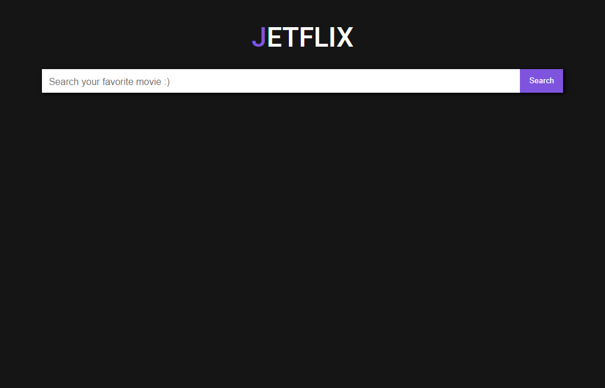
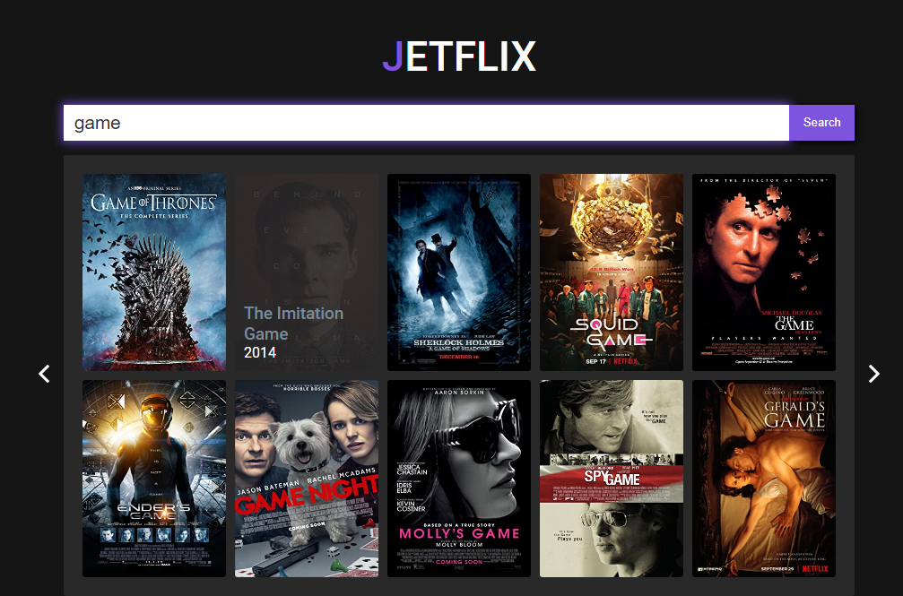
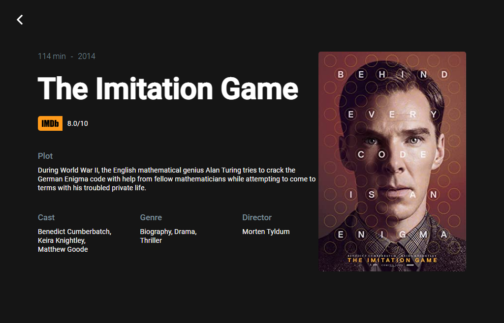

<h1 align="center"> 🎬 JETFLIX </h1>

<h3> 💻 Sobre o projeto</h3>

Essa é um projeto construído com React que utiliza dados da API RESTful OMDb (https://www.omdbapi.com/) para buscar e listar informações de filmes, séries e jogos.

📝 O sistema possui as funcionalidades de:

 <li>Pesquisar filmes, séries ou jogos</li>
 <li>Ver informações detalhadas</li>
  
 
 <h2>🖼 Imagem da tela principal: </h2>

 
 <h2>🖼 Imagem da tela de busca: </h2>

 
 <h2>🖼 Imagem da tela do filme: </h2>

  

<h2>🚀 Tecnologias utilizadas: </h2>

  
  
  
  

 
<h2>👷 Como testar? </h2>
<h3>Entre com o seguinte link: </h3>
<a href="https://api-films.vercel.app/">https://api-films.vercel.app/</a>
<h3>Ou</h3>
<li> Clone o repositório com: git clone https://github.com/johnatanSO/API-films.git
<li> Entre em uma IDE de sua preferência
<li> Execute o npm install, npm install react-router-dom para instalar as dependências
<li> Execute o npm start para iniciar o servidor local

 
 

 <h2>🎓 Autores</h2>
 <h3>Feito com o 💜 by <a href="https://github.com/johnatanSO" target="_blank">Johnatan Santos</a></h3>

